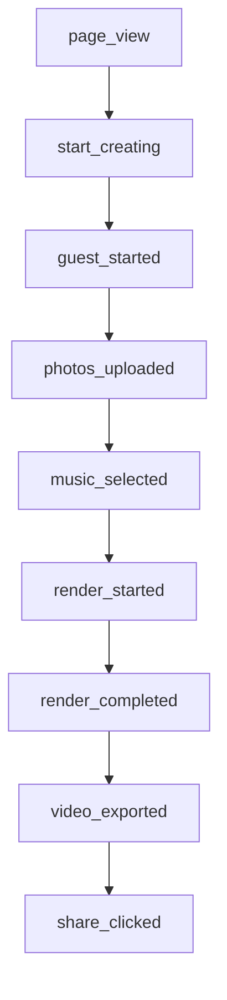

# SnapBeat Google Analytics 4 (GA4) Tracking Architecture

This document details the production-ready Google Analytics 4 (GA4) implementation for **SnapBeat** (`https://www.snapbeat.app/`).

---

## 1. Overview & Architecture

- **Measurement ID**: Configurable via `NEXT_PUBLIC_GA_MEASUREMENT_ID` in `.env.local` / Vercel Environment Variables.
- **Client Script Loading**: Native Next.js 14 Script component loaded in `src/app/layout.jsx` via `src/components/analytics/GoogleAnalytics.jsx` using `strategy="afterInteractive"`.
- **Single Source of Truth**: `src/lib/analytics.js` houses all sanitized event dispatcher functions.
- **Privacy & Compliance**: Guaranteed **Zero PII** transmission. Sensitive fields (`email`, `name`, `password`, `phone`, `token`, `imageData`, `file`) are strictly stripped before reaching GA4.
- **Zero Duplicate Installations**: Verified that only one Google Tag (`gtag.js`) is installed across the entire site.

---

## 2. The Core Conversion Funnel

The complete user journey from first visit to viral export and monetization is tracked end-to-end:

---

## 3. Event Specifications & Parameters

### Funnel Events

| Event Name | Key Conversion? | Trigger Location | Parameters | Description |
| :--- | :---: | :--- | :--- | :--- |
| `page_view` | No | `GoogleAnalytics.jsx` | `page_path`, `page_title`, `page_location` | Triggered on route changes and page loads. |
| `start_creating` | No | `ShowcaseHome.jsx`, `SeoLandingPage.jsx`, `page.jsx` | `page`, `entry_point` | Triggered when user initiates creation from any CTA or enters the studio. |
| `guest_started` | No | `AuthContext.jsx`, `ShowcaseHome.jsx` | `entry_point` | Triggered when a guest session is created for instant zero-friction access. |
| `photos_uploaded` | No | `RetroPhotoStrip.jsx` | `photo_count`, `upload_source` (`file_picker`, `sample_photos`) | Triggered when images are loaded into the sequence bay. |
| `music_selected` | No | `RetroTapeDeck.jsx` | `music_type` (`built_in`, `custom_upload`), `track_id` | Triggered when user selects a soundtrack or uploads an audio file. |
| `render_started` | No | `page.jsx` (`handleStartRender`) | `template`, `photo_count`, `output_resolution`, `aspect_ratio`, `plan_tier` | Triggered when user presses the master Render button. |
| `render_completed` | **YES** | `useRenderJob.js` | `job_id`, `template`, `output_resolution`, `video_duration`, `plan_tier`, `render_success`, `conversion` | Triggered when GPU cluster successfully finishes rendering the video. |
| `render_failed` | No | `useRenderJob.js` | `template`, `error_category`, `stage` | Triggered if render job fails or encounters network/upload issues. |
| `video_exported` | **PRIMARY KEY** | `RetroQueueConsole.jsx` | `template`, `output_resolution`, `export_type`, `watermark`, `plan_type`, `conversion` | Triggered when finished MP4 video reel is downloaded. |
| `share_clicked` | **YES** | `RetroQueueConsole.jsx` | `share_platform` (`native`, `copy_link`), `conversion` | Triggered when user clicks "SHARE REEL". |

---

### Monetization & Auth Events

| Event Name | Key Conversion? | Trigger Location | Parameters | Description |
| :--- | :---: | :--- | :--- | :--- |
| `signup_started` | No | `RetroAuthModal.jsx` | `method` (`modal_open`, `google`, `email`) | Triggered when sign-in modal is opened. |
| `signup_completed` | **YES** | `AuthContext.jsx` | `method`, `is_guest`, `conversion` | Triggered upon successful sign-in or guest profile creation. |
| `upgrade_viewed` | No | `RetroStoreModal.jsx`, `RetroAdBanner.jsx`, `ShowcaseHome.jsx` | `plan_name`, `source` | Triggered when user views Pro plans. |
| `purchase_started` | No | `RetroStoreModal.jsx` | `plan_name`, `value`, `currency` (`INR`) | Triggered when user selects a pricing pass. |
| `purchase_completed`| **PRIMARY KEY** | `RazorpayCheckout.jsx` | `plan_name`, `value`, `currency`, `transaction_id`, `conversion` | Triggered when Razorpay verifies payment transaction. |
| `rewarded_ad_started` | No | `RetroQueueConsole.jsx` | `placement`, `ad_type` | Triggered when 8-second non-skippable pre-roll begins before download. |
| `rewarded_ad_completed`| No | `RetroQueueConsole.jsx` | `placement`, `reward_type` | Triggered when pre-roll finishes and free video export is unlocked. |
| `affiliate_clicked` | No | `RetroQueueConsole.jsx`, `RetroAdBanner.jsx` | `category`, `partner`, `placement` | Triggered when sponsor links or Monetag links are visited. |

---

## 4. Testing & Verification

1. **Local Debugging**:
   - In development mode (`NODE_ENV === "development"`), all events log cleanly to the browser developer console with `[GA4 Event] {eventName}: {params}`.
2. **Google Tag Assistant**:
   - Install the Google Analytics Debugger Chrome Extension.
   - Events appear in GA4 **Admin → DebugView** in real time.
3. **Conversion Marking**:
   - In Google Analytics 4 console:
     - Navigate to **Admin → Events**.
     - Toggle **Mark as conversion** for:
       - `video_exported`
       - `purchase_completed`
       - `render_completed`
       - `signup_completed`
       - `share_clicked`
